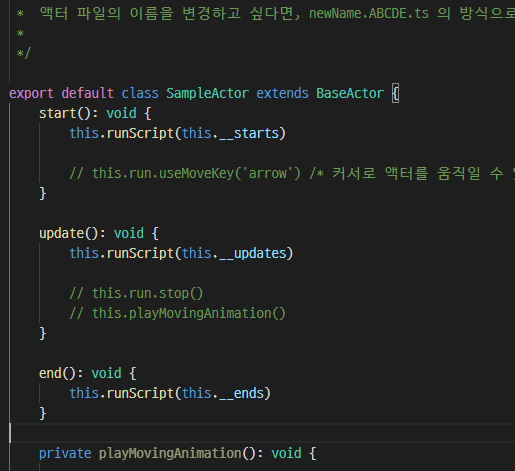

## 액터란?

액터란, 게임 내에서 물리효과를 가지고 있으며, 다른 액터와 상호작용하는 게임 오브젝트를 의미합니다.  
설명이 너무 어려웠나요? 영어 단어 그대로 해석해보세요. 액터. **배우**라는 의미입니다.

게임을 하나의 영화라고 생각한다면, 액터는 그 영화의 등장인물이죠.  
즉 플레이어의 캐릭터, NPC, 몬스터 이런 모든 것들을 액터라고 부릅니다.

액터는 물리엔진의 영향을 받습니다. 즉, 다른 액터들과 충돌하며, 겹쳐질 수 없습니다.  
물론 벽이나 건물같은 것들 역시 건너갈 수 없습니다.

## 프로그래밍이 필요해

액터는 프로그래밍이 필요합니다.  
이 강좌에서는 여러분이 프로그래밍 지식이 없다는 걸 기준으로 두고 진행될 겁니다.  
따라서 프로그래밍에 익숙하시다면 아래 내용은 뛰어 넘으셔도 됩니다.  
프로그래밍에 대한 용어를 알고 싶으시다면 [프로그래밍 기초 문서](./lets-learn-programming)를 참고해주세요.

## 기본 액터 (BaseActor)

자, 새로운 액터를 만들어봅시다.  
그 액터는 기본적으로 에리엔진에서 미리 만들어둔 액터를 상속받습니다.

이 액터는 `battle`, `run`, `bubble`, `particle`같은 기능을 가지고 있습니다.  
이 기능들에 대해 간단한 설명을 들어봅시다.

### battle

전투에 관련된 기능들입니다.  
액터가 스킬을 사용하고, 스킬에 적중된 적은 어떤 피해를 받고, 이기고, 지는지에 대한 기능들이 들어있습니다.  
이 기능을 잘 응용하여 전투시스템을 턴제/실시간으로 만들 수 있습니다.

### run

액터의 움직임에 관련된 기능들입니다.  
키보드 커서를 눌렀을 때 움직인다던가, 특정 위치까지 액터가 길을 찾아 알아서 달려간다던가,  
이런 기능들은 직접 구현하기에 복잡하고 어려운 기능들입니다.

에리엔진에선 이런 기능들을 미리 구현해두었습니다.

### bubble

액터의 말풍선 기능입니다.  
액터가 어떤 대사를 말하거나, 또는 감정표현 이모티콘을 사용하고 싶을 때 이 기능을 사용할 수 있습니다.

### particle

파티클이란 입자효과를 의미합니다.  
가령 액터의 주변으로 불이 번진다던가, 퍼져나가는 효과를 구현하기에 편리합니다.

## 액터를 프로그래밍하기

이렇듯, 에리엔진은 게임에서 보편적으로 사용되는 기능들을 쉽고 빠르게 이용할 수 있습니다.  
물론 이것만으로도 간단한 게임을 만들기에는 충분하겠죠.  
하지만 더 멋진 게임을 만들기 위해선, 직접 프로그래밍 할 필요가 있습니다.

새로운 액터를 만들면 다음과 같은 모습일 것입니다.

`start`, `update`, `end` 3가지 메서드가 보일 것입니다.  
이것은 액터의 라이프사이클입니다.

…근데 라이프사이클이 뭐냐고요?  
[이 문서](./about-actor-lifecycle)를 확인하세요.