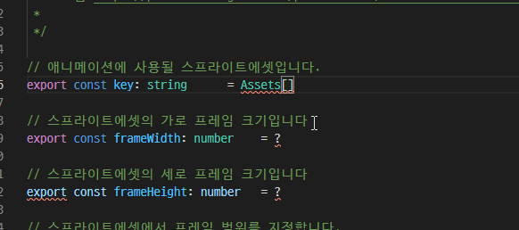

## 애니메이션 만들기

### Q. 애니메이션이 뭐죠?

흔히 움짤이라고 합니다. 게임의 대부분을 차지하는 요소입니다.  
가령 아래 이미지와 같습니다.

캐릭터가 달리고 있습니다. 하지만 이는 GIF파일(움짤)이 아닙니다.  
실제 게임에서 gif파일이 사용되는 경우는 매우 드뭅니다. 대부분의 게임은 **스프라이트시트**를 이용합니다.

### Q. 스프라이트시트는 뭔데요?

위 애니메이션의 원본은 아래 사진과 같습니다.

네, 영화의 필름과 비슷합니다.  
이미지를 일정한 간격을 두고 배치한 다음에, 빠르게 컷을 넘긴 것입니다.

가령 위 이미지의 경우, 총 15개의 이미지가 들어있습니다.  
우리는 이것을 15프레임이라고 부릅니다. 위 이미지는 15프레임의 이미지인 것이죠.

그러니까 이런 스프라이트시트를 이용하여, 실제 움직이는 사진처럼 만드는 작업, 이것을 **애니메이션**이라고 합니다.

## 애니메이션으로 만드는 방법

새로운 애니메이션 파일을 만들어보도록 합시다.  
생성된 파일을 열어본다면 이런 내용이 있을 겁니다.

저 모든 정보를 기입해야 실제 동작하는 애니메이션을 만들 수 있습니다.  
아래에 빨간색의 밑줄이 생겼다는 것은, 잘못된 정보를 기입했다는 의미입니다. 고쳐보도록 합시다.

### key

이 애니메이션에서 사용될 스프라이트시트 에셋을 말합니다.  
아래 사진처럼 대괄호 사이에 따옴표를 기입하면, 자동으로 프로젝트에 추가한 에셋 목록을 보여줍니다.

보여지는 목록 중에서 애니메이션에 사용될 스프라이트에셋 파일을 선택해주세요.

### frameWidth

스프라이트시트에 있는 **프레임 하나의 가로 크기**를 지정합니다.  
가령 위 스프라이트시트의 파일은 *2550x210* 사이즈입니다.  
근데 15프레임이라고 했죠? 즉, 한 프레임의 크기는 *2550/15 = 170*입니다.

따라서 *frameWidth*은 *170*을 기입해주면 됩니다.

### frameHeight

위와 같습니다. **프레임 하나의 세로 크기**를 의미합니다. *210*이 되겠습니다.

### start

애니메이션의 첫 번째 프레임의 위치입니다.  
이 개념을 설명하기 위해 새로운 스프라이트시트를 보여드리겠습니다.

이 스프라이트시트는 총 9프레임입니다.  
하지만 총 3개의 모션을 가지고 있습니다. 왼쪽/오른쪽으로 이동, 그리고 멈춰있는 모션입니다.

왼쪽으로 움직이는 모션은 처음 4개, 멈춰있는 모션은 가운데 1개, 오른쪽으로 움직이는 모션은 마지막 4개입니다.  

만일 왼쪽으로 움직이는 애니메이션을 만들고 싶다면, 0, 1, 2, 3프레임만을 사용하겠죠. 이 경우, *start* 값은 *0*이 됩니다.  
오른쪽으로 움직이는 애니메이션을 만들고 싶다면 5, 6, 7, 8프레임을 사용하므로 *5*가 될 것입니다.

### end

애니메이션의 마지막 프레임의 위치입니다.  
위 예시에서, 왼쪽으로 움직이는 애니메이션을 만들고 싶다면 0, 1, 2, 3프레임이 사용되므로 *end*값은 *3*이 됩니다.  
오른쪽으로 움직이는 애니메이션은 5, 6, 7, 8프레임을 사용하므로 *8*이 됩니다.

### frameRate

초당 재생될 프레임의 개수입니다. 숫자가 커질수록 재생 속도가 빨라집니다.  
*10*을 입력하면, 0.1초당 1프레임을 보여준다는 의미입니다.

### repeat

애니메이션을 재생할 때, 반복될 횟수를 의미합니다.  
*-1*으로 지정하면 무한반복 재생됩니다.