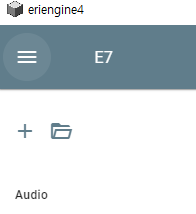
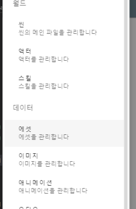
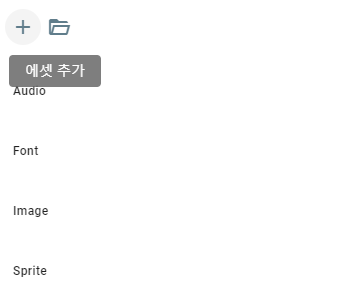
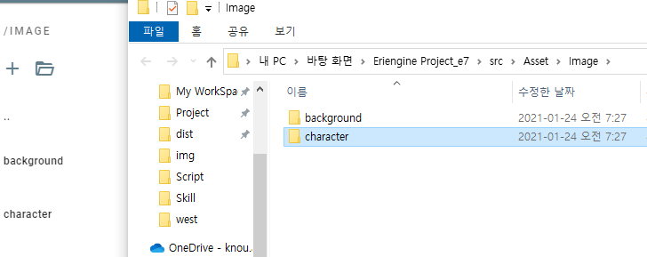

## 에셋 추가하기

에셋(Asset)이란, 게임 내에서 사용될 모든 파일을 의미합니다.  
이미지, 오디오, 비디오, 글꼴 등을 의미합니다.

에리엔진에서 사용될 에셋은 크게 위의 4종류로 나뉩니다.  
일단 아무런 에셋을 추가해보도록 합시다. 저는 예시로 이미지를 추가해보도록 하겠습니다.

## 네비게이션 열기

  
엔진 좌측 상단의 네비게이션 버튼을 클릭하세요.

  
이후 열린 창에서 **에셋**을 클릭합니다.

## 프로젝트 폴더로 에셋을 불러오기

  
이동된 페이지에서 **+** 버튼을 선택하세요. 에셋을 추가할 수 있는 창이 뜹니다.

## 잘 정리하자

에셋을 그룹화하여 정리하는 것이 좋습니다.  
가령 이미지는 이미지끼리, 오디오는 오디오끼리 폴더로 묶어서 정리하는 것이죠.

  
**폴더 열기** 기능을 이용해보세요.  
현재 디렉토리 위치를 열어줍니다. 열린 폴더에 여러분 마음대로 에셋을 그룹화하세요.  
가령 같은 이미지라 하더라도, 배경이나, 캐릭터 이미지가 따로 있을 겁니다.

정리하고나면 이런 모양새가 되지 않을까요?

정답은 없습니다. 여러분이 편한대로 그룹화하시면 됩니다.