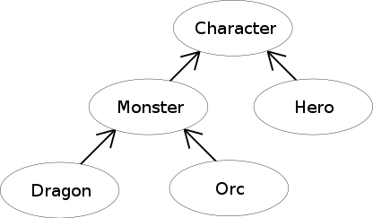

### 상속이란?

프로그래밍에 익숙하지 않은 분들이라면 *이게 무슨 소리여?* 하실 겁니다.  
상속이란, 프로그래밍에서 사용되는 용어입니다. 하지만 동시에 국어사전에 있는 단어이기도 하죠.

자식은 부모의 재산을 상속 받습니다.  
이 말은, 부모의 것은 자식도 쓸 수 있다는 의미가 됩니다.  
하지만 반대는 안됩니다. 자식의 것을 뺏어쓰는 부모는 없습니다. 적어서 프로그래밍에선 말이죠.

### 프로그래밍에서 상속이란?

가령 여러분이 몬스터를 만든다고 가정합시다.  
몬스터의 이름은 **오크**이고, 오크는 **하울링**이란 스킬을 가지고 있습니다.

그런데 **하이오크**라는 새로운 몬스터가 필요합니다.  
**하이 오크**는 **하울링**도 사용할 수 있지만, 더 진보한 개체라 **물어뜯기**라는 스킬 역시 사용합니다.

보시다시피, **하울링**이란 스킬이 중복됩니다.  
그렇다면 같은 스킬을 두 번 프로그래밍해야 하는 걸까요? 귀찮겠죠?

이 경우 **오크**를 부모로, **하이오크**를 자식으로 프로그래밍 할 수 있습니다.

이렇게 되면 **하이오크**는 **오크**가 가지고 있는 **하울링** 스킬을 상속받아 사용할 수 있을 뿐더러, 자신의 **물어뜯기** 기술 역시 사용합니다.  
하지만 역은 성립하지 않기에, **오크**는 자식 액터인 **하이오크**의 **물어뜯기**를 사용할 수 없습니다.

만일 **제네럴 오크**가 필요하다면, 이번엔 **하이오크**를 상속받을 수도 있을 겁니다.  
이 경우, **제네럴 오크**는 **하울링**, **물어뜯기**, 그리고 자신의 스킬을 모두 사용할 수 있겠지요.

이것이 프로그래밍의 상속이며, 쉽게 개발할 수 있는 핵심입니다.  
여러분은 같은 코드를 두 번이나 반복해서 작성할 필요가 없어집니다. 관리도 쉽고 말이죠.

## 액터 디자인 심화 과정

이미지를 참고해보세요.  
좋은 액터 디자인을 만들기 위해선 어떻게 만들어야 할까요?

### 공통점 찾기

상속을 쉽게 만들기 위해선 일단 공통점을 찾아야합니다.  

일단 **몬스터(Monster)**와 **영웅(Hero)**은 서로 적대해야겠네요.
그렇다면 세력 관계에 대한 정보도 있어야겠어요.  
*이 액터는 어느 세력에 속해있다, 그리고 서로 세력이 다르면 싸운다*, 라는 정보가 필요합니다.

가령 Monster의 세력은 **마왕**의 세력입니다. Hero의 세력은 **인간국**이라고 가정해볼게요.  
그리고 서로 싸워야하니, HP(Hit Point)의 정보도 필요합니다.

공통된 조상, 이 정보는 **Character**에서 프로그래밍하면 될 것입니다.